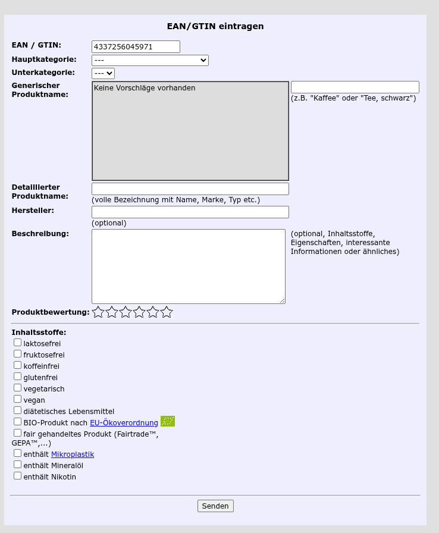

# Product Data

## API URL
http://opengtindb.org/?ean=[ean]&cmd=query&queryid=[userid]

## Get personal User an Testuser
https://opengtindb.org/userid.php

There is a Testuser with restrictions (max total requests = 500, Error Code: 5 -> access litmit)  
User-ID 400000000 

## Error Codes (API Access)
0 - OK - Operation war erfolgreich  
1 - not found - die EAN konnte nicht gefunden werden  
2 - checksum - die EAN war fehlerhaft (Checksummenfehler)  
3 - EAN-format - die EAN war fehlerhaft (ungültiges Format / fehlerhafte Ziffernanzahl)  
4 - not a global, unique EAN - es wurde eine für interne Anwendungen reservierte EAN eingegeben(In-Store, Coupon etc.)  
5 - access limit exceeded - Zugriffslimit auf die Datenbank wurde überschritten  
6 - no product name - es wurde kein Produktname angegeben  
7 - product name too long - der Produktname ist zu lang (max. 20 Zeichen)  
8 - no or wrong main category id - die Nummer für die Hauptkategorie fehlt oder liegt außerhalb des erlaubten Bereiches  
9 - no or wrong sub category id - die Nummer für die zugehörige Unterkategorie fehlt oder liegt außerhalb des erlaubten Bereiches  
10 - illegal data in vendor field - unerlaubte Daten im Herstellerfeld  
11 - illegal data in description field - unerlaubte Daten im Beschreibungsfeld  
12 - data already submitted - Daten wurden bereits übertragen  
13 - queryid missing or wrong - die UserID/queryid fehlt in der Abfrage oder ist für diese Funktion nicht freigeschaltet  
14 - unknown command - es wurde mit dem Parameter "cmd" ein unbekanntes Kommando übergeben  

## Ingridient Label
The field "contents" can have the following content
- 1 (binär 000000000001) - laktosefrei
- 2 (binär 000000000010) - koffeeinfrei
- 4 (binär 000000000100) - diätetisches Lebensmittel
- 8 (binär 000000001000) - glutenfrei
- 16 (binär 000000010000) - fruktosefrei
- 32 (binär 000000100000) - BIO-Lebensmittel nach EU-Ökoverordnung
- 64 (binär 000001000000)   - fair gehandeltes Produkt nach FAIRTRADE™-Standard
- 128 (binär 000010000000)  - vegetarisch
- 256 (binär 000100000000)  - vegan
- 512 (binär 001000000000)  - Warnung vor Mikroplastik
- 1024 (binär 010000000000) - Warnung vor Mineralöl
- 2048 (binär 100000000000) - Warnung vor Nikotin

## Package 
packaging is stored in the field "pack" 
- 1 (binär 000000000001) - die Verpackung besteht überwiegend aus Plastik
- 2 (binär 000000000010) - die Verpackung besteht überwiegend aus Verbundmaterial
- 4 (binär 000000000100) - die Verpackung besteht überwiegend aus Papier/Pappe
- 8 (binär 000000001000) - die Verpackung besteht überwiegend aus Glas/Keramik/Ton
- 16 (binär 000000010000) - die Verpackung besteht überwiegend aus Metall
- 32 (binär 000000100000) - ist unverpackt (immer zusammen mit 64, nie zusammen mit 128 und 256)
- 64 (binär 000001000000) - die Verpackung ist komplett frei von Plastik (nie zusammen mit 1 oder 2)
- 128 (binär 000010000000) - Artikel ist übertrieben stark verpackt (nie zusammen mit 32)
- 256 (binär 000100000000) - Artikel ist angemessen sparsam verpackt
- 512 (binär 001000000000) - Pfandsystem / Mehrwegverpackung

## Fields
- error - int @see Error Codes
- "---" - divider between error code and data, divides multiple data entries
- name - string, product name
- detailname - string, detailed product name
- vendor - string, vendor
- maincat - string, the main category (@see Category)
- subcat - string, the subcategory
- maincatnum - int, number maincategory
- subcatnum - int, number subcategory
- contens - @see ingredient label
- pack - @see package
- descr - detailed description
- origin - land
- validated - percentage validated

## Main and Subcategories
- Baby, Kind
  - "Ausstattung", "Babygetränke", "Babynahrung", "Gesundheit, Pflege", "Kleider, Textilien", "Spiele Lernen", "Wickel"  
- Backwaren
  - "Backmischungen", "Backzutaten", "Brotarten", "Dauerbackwaren, Zwieback", "Frischbackwaren", "Gebäck, Panettone", "Hefe", "Kuchen, Cakes", "Teig"
- Brotaufstriche
  - "Honig", "Konfitüren, Marmeladen", "verschiedene"
- Dessert, Nachtisch
  - "Creme", "Pudding", "Speiseeis"
- Eier
  - "Eier"
- Elektrisch
  - "Anschluss-und Verbrauchsmaterial", "Batterien", "Licht", "Netzteile, Ladegeräte"
- Elektronische Artikel
  - "Computer", "Fotografie", "HIFI", "Massenspeichermedien", "Tablet / PDA", "TV, Fernsehen", "Telefon", "Uhren", "Video", "DVD", "BD (Blu-ray)"
- Fertiggerichte
  - "Andere", "Asia Gerichte", "Bouillon, Brühe", "Fleischerzeugnisse", "Gericht, Menü", "Kartoffelprodukte", "Pasta", "Pizza", "Salat", "Sandwich", "Saucen", "Suppen", "Tiefgekühltes, Tiefkühlkost"
- Fleisch, Fisch
  - "Fisch", "Fischkonserven", "Fleischkonserven", "Frischfleisch", "Geflügel", "Meeresfrüchte", "Trockenfleisch, Salami", "Wurstwaren"
- Früchte, Obst
  - "Exotische Früchte", "Früchte, Obst", "Nüsse", "Obstkonserven", "Trockenfrüchte", "kandierte Früchte"
- Gemüse
  - "Antipasti", "Essigkonserven", "Gemüse", "Gemüsekonserven", "Salat", "Trockengemüse"
- Getränke, Alkohol
  - "Alcopops", "Bier", "Energy Drinks", "Frucht-und Gemüsesäfte", "Instantgetränke", "Kaffee", "Kakao,Schokoladen", "Limonaden", "Mineralwasser", "Sirup", "Spirituosen", "Tee", "Wein/Sekt/Champagner"
- Haushalt, Büro
  - "Bücher allgemein", "Fachbücher", "Literatur", "Bügeln, Textilpflege", "Dekoration", "Essen", "Garten", "Kleider, Textilien", "Küche", "Küchen-, Haushaltgeräte", "Kurzwaren/Mercerie", "Papeterie", "Zeitungen, Zeitschriften allgemein", "Fachzeitungen, -zeitschriften", "Schreib- und Zeichengeräte"
- Kochzutaten
  - "Backpulver", "Essig", "Frische Gewürze", "Gelatine", "Gewürze", "Mehl", "Öl, Fette", "Salz", "Senf, Mayonnaise, Püree, Cremen", "Stärkearten"
- Konditorei, Zuckerwaren
  - "Kuchendekoration", "Marzipan", "Süßstoffe", "Zucker"
- Kosmetische Mittel
  - "Badezusätze", "Gesichtspflege", "Haarpflege", "Körperpflege", "Make-up Artikel", "Monatshygiene", "Nagel, Fusspflege", "Parfüm", "Pflaster, Watte", "Rasierprodukte", "Schwangerschaftstest", "Sonnen-, Insektenschutz", "Toilettenartikel", "Verhütung", "Zahnpflege"
- Milchprodukte
  - "Butter, Margarine", "Joghurt", "Käse", "Milch", "Milchgetränke", "Quark", "Rahm, Rahmprodukte"
- Präparate
  - "Calcium", "Magnesium", "Medikamente", "Sonstige", "Vitamine", "kombinierte Präparate"
- Raucherwaren
  - "Tabak", "Zigaretten", "Zigarren", "Zubehör"
- Sojaprodukte
  - "Sojamilch", "Sojasaucen", "Tofu", "sonstiges"
- Süsswaren, Snacks
  - "Bisquits, Kekse, Konfekt", "Bonbons", "Chips", "Energiespender", "Fruchtgummi", "Getreide, Schokoriegel, Waffeln", "Kaugummi", "Schokolade", "salzige Snacks"
- Teigwaren, Getreideprodukte
  - "Frühstücksflocken", "Getreide", "Teigwaren"
- Tierbedarf
  - "Hunde", "Katzen", "Nager", "Sonstige"
- Waschen, Reinigen
  - "Abwaschen", "Boden- und Teppichreiniger", "Entkalker", "Entsorgen", "Fleckenreiniger", "Glas-und Festerreiniger", "Küchenreiniger", "Lufterfrischer", "Putzgeräte und Zubehör", "Putzmittel", "Schuhpflege", "Spezialreiniger", "WC- und Bad Reiniger", "Waschmittel", "Wohnzimmerreiniger"
- Zusatzstoffe
  - "Zusatzstoffe"
- Haus, Hof und Freizeit
  - "Baumaterialien", "Farbe", "Werkzeuge", "Pflanzenmittel", "Pflanzen", "Modellbau", "Sportgeräte", "Sonstige", "Spielzeug/Spiele", "Sanitärmaterial"

## Example
### Request 
`http://opengtindb.org/?ean=8712566126057&cmd=query&queryid=400000000`

### Response
```

error=0
---
asin=
name=
detailname=Lukull Sauce Hollandaise Balance 250 ml
vendor=Lukull
maincat=
subcat=
maincatnum=-1
subcatnum=
contents=
origin=Niederlande
descr=Trinkwasser, entrahmte MILCH, pflanzliche Öle (Palm, Raps), EIGELB, modifizierte Stärke, Zucker, Speisesalz, Zitronensaftkonzentrat, Verdickungsmittel (Xanthan, Guarkernmehl, Johannisbrotkernmehl), Säuerungsmittel (Milchsäure), Aromen (mit MILCH, SELLERIE) Dextrose.Kann GLUTEN enthalten. Nährwertangaben je 100 ml Brennwert 710 kJ 170 kcal Fett 15,0 g davon gesättigte Fettsäuren 5,0 g Kohlenhydrate 6,0 g davon Zucker 3,0 g Eiweiß 2,0 g Salz 1,0 g Ballaststoffe 0,3 g Sonderpreis: geringes Mindesthaltbarkeitsdatum
name_en=
detailname_en=
descr_en=
validated=0 %
---
```

## add product form
